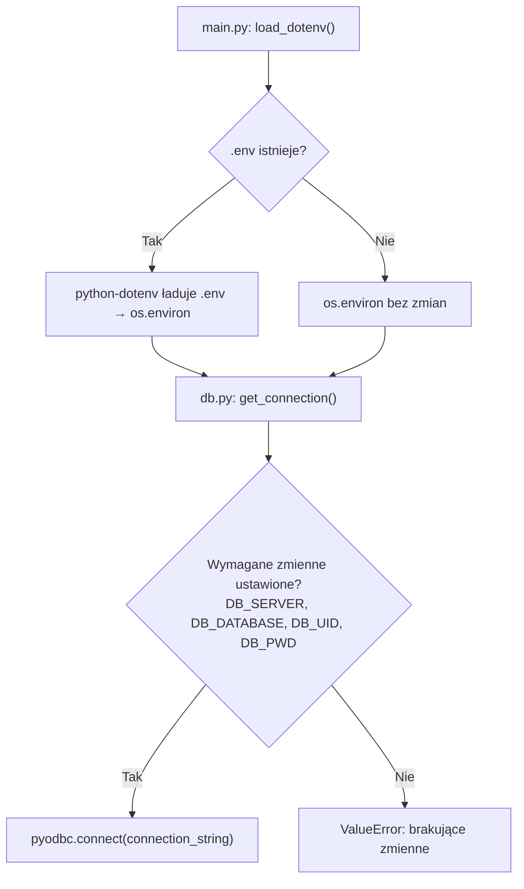
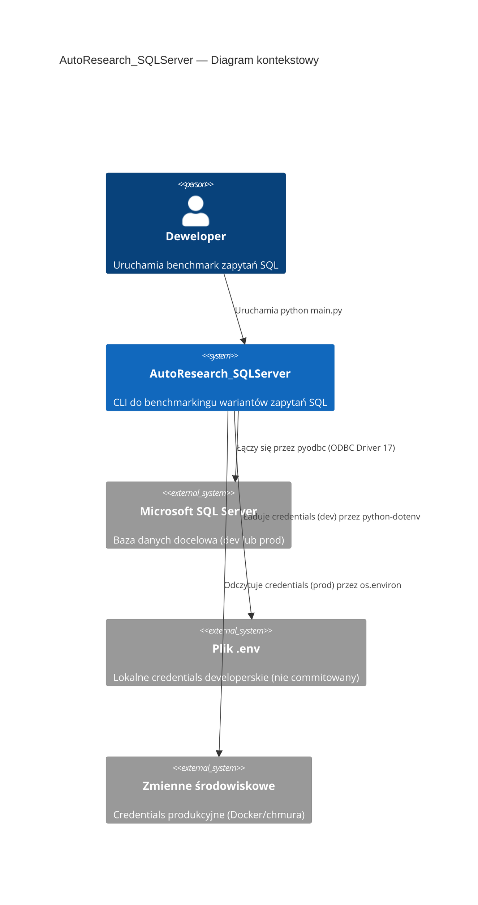
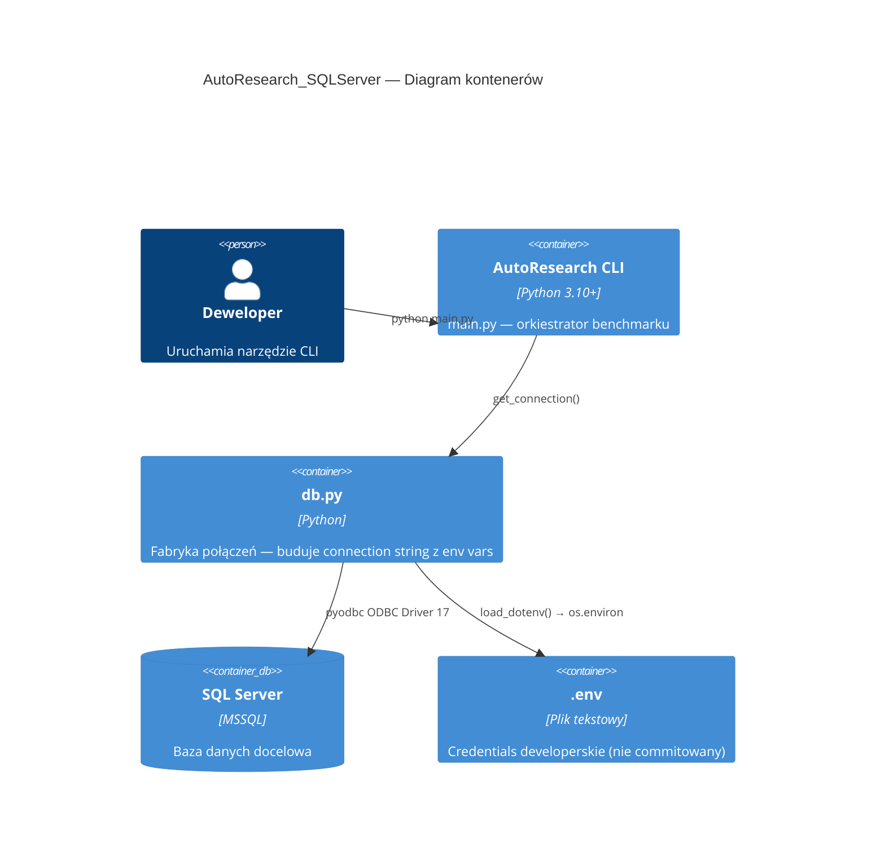

# Bezpieczne przechowywanie danych połączenia do bazy danych - Plan Implementacji

## Szczegóły Zadania

| Pole | Wartość |
|---|---|
| Tytuł | Bezpieczne przechowywanie danych połączenia do bazy danych |
| Opis | Usunięcie hardkodowanych credentials z `db.py`, wdrożenie podejścia hybrydowego (python-dotenv + zmienne środowiskowe) z walidacją wymaganych zmiennych. Likwidacja naruszeń SonarQube: `python:S2068` i `secrets:S6703`. |
| Priorytet | Wysoki (bezpieczeństwo) |
| Powiązany Research | `secure-database-credentials.research.md` |

## Proponowane Rozwiązanie

Zastąpienie hardkodowanych credentials w `db.py` odczytem ze zmiennych środowiskowych za pomocą `python-dotenv`. Rozwiązanie opiera się na 3 elementach:

1. **`python-dotenv`** — ładuje pary klucz-wartość z pliku `.env` do `os.environ` na starcie aplikacji. Wywołanie `load_dotenv(override=False)` nie nadpisuje istniejących zmiennych systemowych — credentials z Docker/chmury mają priorytet.
2. **`db.py`** — buduje connection string dynamicznie z `os.environ`, waliduje obecność wymaganych zmiennych, zgłasza czytelny `ValueError` przy brakach.
3. **`.env.example`** — commitowany szablon z placeholder'ami dokumentujący wymagane zmienne. Deweloper kopiuje go do `.env` i uzupełnia prawdziwymi wartościami.



## Uzasadnienie Rozwiązania

### Wybrane podejście

**python-dotenv + zmienne środowiskowe (podejście hybrydowe)** — minimalna inwazyjność (1 mikro-zależność, zmiana w 1 pliku kodu), pełna zgodność z 12-Factor App i OWASP, naturalna obsługa wielu środowisk (dev: `.env`, prod: zmienne systemowe Docker/chmury).

### Porównanie z alternatywami

> Szczegółowa matryca porównawcza: `secure-database-credentials.solution-research.md`

| Kryterium | python-dotenv + env vars | Czyste env vars | python-decouple | dynaconf |
|---|---|---|---|---|
| Wygoda dev (DX) | ⭐⭐⭐⭐⭐ | ⭐⭐⭐ | ⭐⭐⭐⭐ | ⭐⭐⭐⭐ |
| Minimalizm zależności | ⭐⭐⭐⭐ | ⭐⭐⭐⭐⭐ | ⭐⭐⭐⭐ | ⭐⭐ |
| Bezpieczeństwo | ⭐⭐⭐⭐⭐ | ⭐⭐⭐⭐⭐ | ⭐⭐⭐⭐⭐ | ⭐⭐⭐⭐⭐ |
| Obsługa wielu środowisk | ⭐⭐⭐⭐⭐ | ⭐⭐⭐⭐ | ⭐⭐⭐⭐⭐ | ⭐⭐⭐⭐⭐ |
| **Ocena ogólna** | **⭐⭐⭐⭐⭐** | **⭐⭐⭐⭐** | **⭐⭐⭐⭐** | **⭐⭐⭐** |

### Dlaczego odrzucono alternatywy

- **Czyste env vars (os.environ)**: Brak `.env` — deweloper musi ręcznie ustawiać zmienne przed każdym uruchomieniem. Gorsze DX bez realnej korzyści.
- **python-decouple**: Castowanie typów niepotrzebne (connection string = same stringi). Mniej popularny od python-dotenv.
- **dynaconf**: Overengineering — projekt ma 5 plików źródłowych i 1 zależność. Dynaconf dodaje wiele sub-dependencies.

## Model C4

### Diagram kontekstowy (Context)

> Diagram z analizy rozwiązań — patrz `secure-database-credentials.solution-research.md`.



### Diagram kontenerów (Container)



### Diagram komponentów (Component)

Nie dotyczy — zadanie obejmuje pojedynczy komponent (`db.py`).

## Rejestry Decyzji Architektonicznych (ADR)

### ADR-001: Wybór mechanizmu zarządzania credentials

| Pole | Wartość |
|---|---|
| Status | Zaakceptowany |
| Data | 2026-04-07 |
| Kontekst | Credentials do bazy danych są hardkodowane w `db.py`, co narusza reguły SonarQube python:S2068 i secrets:S6703. Potrzebny mechanizm externalizacji credentials wspierający środowisko dev i przyszłe prod (Docker/chmura). |

**Rozważane opcje**:
1. **python-dotenv + env vars** — `.env` w dev, zmienne systemowe w prod
2. **Czyste env vars (os.environ)** — bez dodatkowych zależności
3. **python-decouple** — `.env` z castowaniem typów
4. **dynaconf** — zaawansowany framework konfiguracyjny

**Decyzja**: python-dotenv + env vars (opcja 1)

**Uzasadnienie**: Najlepsza równowaga wygody dev i bezpieczeństwa prod przy minimalnej inwazyjności. 1 mikro-zależność (zero sub-dependencies) uzasadniona eliminacją krytycznej luki bezpieczeństwa.

**Konsekwencje**:
- ✅ Credentials usunięte z kodu źródłowego — likwidacja python:S2068 i secrets:S6703
- ✅ `.env.example` jako samo-dokumentacja wymaganych zmiennych
- ✅ `load_dotenv(override=False)` — kompatybilne z Docker i cloud secrets managerami
- ⚠️ Dodanie 1 zależności (`python-dotenv`) — uzasadnione bezpieczeństwem

### ADR-002: Punkt wywołania load_dotenv()

| Pole | Wartość |
|---|---|
| Status | Zaakceptowany |
| Data | 2026-04-07 |
| Kontekst | `load_dotenv()` musi być wywołane przed pierwszym użyciem `os.environ` w `db.py`. Kluczowe jest, aby ładowanie `.env` następowało na początku procesu — przed jakimkolwiek odwołaniem do zmiennych środowiskowych. |

**Rozważane opcje**:
1. **Wywołanie w `db.py`** (na poziomie modułu) — `load_dotenv()` na początku pliku
2. **Wywołanie w `main.py`** — przed importem/użyciem `db`

**Decyzja**: Wywołanie w `db.py` na poziomie modułu (opcja 1)

**Uzasadnienie**: `db.py` jest jedynym konsumentem zmiennych konfiguracyjnych. Umieszczenie `load_dotenv()` w `db.py` zapewnia enkapsulację — konfiguracja i jej ładowanie w jednym module. Nie wymaga zmian w `main.py`.

**Konsekwencje**:
- ✅ Enkapsulacja — cała logika połączenia w jednym pliku
- ✅ `main.py` nie wymaga żadnych zmian
- ⚠️ `load_dotenv()` wykona się przy imporcie `db` — akceptowalne, bo jest idempotentne i szybkie

## Analiza Aktualnej Implementacji

### Już Zaimplementowane
- `runner.py` — `run_query()` — `runner.py` — konsumuje `get_connection()`, interfejs się nie zmienia
- `main.py` — orkiestrator CLI — `main.py` — bez zmian, nie dotyka konfiguracji DB
- `variants.py` — generator wariantów — `variants.py` — bez zmian
- `query.sql` — bazowe zapytanie SQL — `query.sql` — bez zmian
- `.gitignore` — `.gitignore` — **już zawiera wpis `.env`** (linia 133) — bez zmian

### Do Modyfikacji
- `db.py` — `db.py` — zastąpienie hardkodowanych credentials odczytem z `os.environ`, dodanie `load_dotenv()`, walidacja wymaganych zmiennych
- `requirements.txt` — `requirements.txt` — dodanie `python-dotenv>=1.0.0`
- `README.md` — `README.md` — aktualizacja sekcji Configuration i Installation
- `CHANGELOG.md` — `CHANGELOG.md` — dodanie wpisu w sekcji `[Unreleased]`

### Do Utworzenia
- `.env.example` — szablon konfiguracji z placeholder'ami (commitowany do repozytorium)

## Otwarte Pytania

| # | Pytanie | Odpowiedź | Status |
|---|----------|--------|--------|
| 1 | Czy użytkownik korzysta z Windows Auth czy SQL Auth? | SQL Authentication (login/hasło) | ✅ Rozwiązane |
| 2 | Gdzie będzie uruchamiana aplikacja na prod? | Docker lub chmura — zmienne środowiskowe kontenera/secrets managera | ✅ Rozwiązane |

## Plan Implementacji

### Faza 1: Externalizacja credentials

#### Zadanie 1.1 - [UTWÓRZ] Plik `.env.example` z szablonem konfiguracji
**Opis**: Utworzenie pliku `.env.example` w katalogu głównym repozytorium z placeholder'ami dla wszystkich zmiennych konfiguracyjnych. Plik jest commitowany do repozytorium i służy jako dokumentacja wymaganych zmiennych.

**Definicja Ukończenia (Definition of Done)**:
- [x] Plik `.env.example` istnieje w katalogu głównym
- [x] Zawiera zmienne: `DB_DRIVER`, `DB_SERVER`, `DB_DATABASE`, `DB_UID`, `DB_PWD`
- [x] Każda zmienna ma komentarz wyjaśniający jej rolę
- [x] Wartości to placeholder'y — brak prawdziwych credentials
- [x] `DB_DRIVER` ma wpisaną wartość domyślną `ODBC Driver 17 for SQL Server`

#### Zadanie 1.2 - [MODYFIKUJ] Dodanie `python-dotenv` do `requirements.txt`
**Opis**: Dodanie pakietu `python-dotenv` do pliku zależności z dolnym ograniczeniem wersji.

**Definicja Ukończenia (Definition of Done)**:
- [x] `requirements.txt` zawiera wpis `python-dotenv>=1.0.0`
- [x] Format wpisu zgodny z istniejącą konwencją w pliku (np. `pyodbc==5.3.0`)

#### Zadanie 1.3 - [MODYFIKUJ] Refaktor `db.py` — usunięcie hardkodowanych credentials
**Opis**: Przepisanie `db.py` tak, aby:
- Na poziomie modułu wywoływał `load_dotenv(override=False)`
- Odczytywał credentials ze zmiennych środowiskowych (`os.environ` / `os.getenv`)
- `DB_DRIVER` miał wartość domyślną `ODBC Driver 17 for SQL Server`
- Walidował obecność wymaganych zmiennych (`DB_SERVER`, `DB_DATABASE`, `DB_UID`, `DB_PWD`) i zgłaszał czytelny `ValueError` z listą brakujących zmiennych
- Connection string budowany dynamicznie z odczytanych zmiennych
- Sygnatura `get_connection()` pozostała bez zmian (brak zmian w `runner.py`)

**Docelowa struktura `db.py`**:
```python
import os
import pyodbc
from dotenv import load_dotenv

load_dotenv(override=False)

def get_connection():
    driver = os.getenv("DB_DRIVER", "ODBC Driver 17 for SQL Server")
    server = os.environ.get("DB_SERVER")
    database = os.environ.get("DB_DATABASE")
    uid = os.environ.get("DB_UID")
    pwd = os.environ.get("DB_PWD")

    missing = [name for name, val in [
        ("DB_SERVER", server), ("DB_DATABASE", database),
        ("DB_UID", uid), ("DB_PWD", pwd)
    ] if not val]
    if missing:
        raise ValueError(
            f"Missing required environment variables: {', '.join(missing)}. "
            "Copy .env.example to .env and fill in the values."
        )

    return pyodbc.connect(
        f"DRIVER={{{driver}}};"
        f"SERVER={server};"
        f"DATABASE={database};"
        f"UID={uid};"
        f"PWD={pwd};"
    )
```

**Definicja Ukończenia (Definition of Done)**:
- [x] `db.py` nie zawiera żadnych hardkodowanych credentials (SERVER, DATABASE, UID, PWD)
- [x] `load_dotenv(override=False)` wywoływane na poziomie modułu
- [x] `DB_DRIVER` odczytywany z env z domyślną wartością `ODBC Driver 17 for SQL Server`
- [x] Wymagane zmienne (`DB_SERVER`, `DB_DATABASE`, `DB_UID`, `DB_PWD`) walidowane — brak dowolnej z nich powoduje `ValueError` z czytelnym komunikatem i listą brakujących zmiennych
- [x] Komunikat `ValueError` zawiera wskazówkę: "Copy .env.example to .env and fill in the values."
- [x] Sygnatura `get_connection()` nie zmieniła się — `runner.py` działa bez modyfikacji
- [x] Naruszenia SonarQube `python:S2068` i `secrets:S6703` nie pojawiają się w `db.py`

### Faza 2: Aktualizacja dokumentacji

#### Zadanie 2.1 - [MODYFIKUJ] Aktualizacja `README.md` — sekcja Configuration
**Opis**: Zastąpienie instrukcji "Edit the connection string in `db.py`" nową instrukcją opartą na pliku `.env`. Aktualizacja sekcji Installation o krok kopiowania `.env.example`.

Zmiany w sekcji **Installation**:
- Zmiana `pip install pyodbc` na `pip install -r requirements.txt`

Zmiany w sekcji **Configuration**:
- Usunięcie bloku kodu z hardkodowanym connection stringiem
- Dodanie instrukcji: skopiuj `.env.example` do `.env` i uzupełnij wartości
- Opis każdej zmiennej w tabeli
- Informacja o środowisku produkcyjnym (zmienne systemowe, Docker)

**Definicja Ukończenia (Definition of Done)**:
- [x] Sekcja Configuration nie zawiera przykładu z hardkodowanymi credentials
- [x] Instrukcja konfiguracji oparta na `.env.example` → `.env`
- [x] Tabela z opisem zmiennych (`DB_SERVER`, `DB_DATABASE`, `DB_UID`, `DB_PWD`, `DB_DRIVER`)
- [x] Informacja o środowisku produkcyjnym (zmienne systemowe)
- [x] Sekcja Installation używa `pip install -r requirements.txt`
- [x] Sekcja Project Structure zawiera wpis `.env.example`

#### Zadanie 2.2 - [MODYFIKUJ] Aktualizacja `CHANGELOG.md` — wpis `[Unreleased]`
**Opis**: Dodanie wpisu w sekcji `[Unreleased]` opisującego zmianę konfiguracji — kategoryzacja pod `### Changed` (zmiana sposobu konfiguracji) i `### Security` (likwidacja hardkodowanych credentials).

**Definicja Ukończenia (Definition of Done)**:
- [x] Sekcja `[Unreleased]` zawiera wpis pod `### Changed` opisujący przejście na zmienne środowiskowe
- [x] Sekcja `[Unreleased]` zawiera wpis pod `### Security` opisujący usunięcie hardkodowanych credentials
- [x] Wpisy są w języku angielskim (konwencja projektu)

### Faza 3: Przegląd kodu

#### Zadanie 3.1 - Code Review przez agenta `code-reviewer`
**Opis**: Pełen przegląd kodu obejmujący:
- Weryfikację, że żadne credentials nie pozostały w kodzie źródłowym
- Weryfikację poprawności walidacji zmiennych w `db.py`
- Weryfikację, że `.env` jest w `.gitignore`
- Weryfikację, że `README.md` nie promuje anty-wzorców (edycja credentials w kodzie)
- Sprawdzenie zgodności z instrukcjami projektu (`autoresearch-sqlserver.instructions.md`)

**Definicja Ukończenia (Definition of Done)**:
- [x] Agent `code-reviewer` przeprowadził przegląd i nie zgłosił krytycznych uwag
- [x] Brak hardkodowanych credentials w żadnym pliku repozytorium
- [x] `.env` widnieje w `.gitignore`
- [x] Naruszenia SonarQube `python:S2068` i `secrets:S6703` nie pojawiają się

## Aspekty Bezpieczeństwa

- **Credentials nie mogą znajdować się w kodzie źródłowym** — eliminacja python:S2068 i secrets:S6703
- **`.env` musi być w `.gitignore`** — już jest (linia 133), weryfikacja w code review
- **`.env.example` NIE MOŻE zawierać prawdziwych credentials** — tylko placeholder'y
- **`load_dotenv(override=False)`** — zmienne systemowe mają priorytet, zapobiegając nadpisaniu produkcyjnych credentials plikiem `.env` przypadkowo wdrożonym na serwer
- **Walidacja zmiennych** — brak credentials → czytelny `ValueError` zamiast kryptycznego błędu pyodbc (potencjalnie ujawniającego szczegóły konfiguracji)
- **Connection string budowany dynamicznie** — brak statycznych wzorców wykrywalnych przez skanery secretów
- **OWASP A07:2021** — Identification and Authentication Failures — hardkodowane credentials to typowy wektor ataku eliminowany przez to zadanie

## Strategia Testowania

### Piramida testów

| Typ testu | Zakres | Szacowana liczba | Pokrycie |
|---|---|---|---|
| Manualne | Weryfikacja połączenia z `.env` i bez `.env` | 2 scenariusze | Ścieżka happy path + błąd walidacji |

### Podejście do testowania

Projekt nie posiada infrastruktury testowej (brak `pytest` w zależnościach, brak katalogu `tests/`). Przy obecnej wielkości projektu (1 plik do zmiany, 5 plików źródłowych) dodawanie frameworka testowego byłoby overengineeringiem.

Weryfikacja manualna:
- [ ] Uruchomienie `python main.py` z poprawnym `.env` — oczekiwane: połączenie działa, benchmark się wykonuje
- [ ] Uruchomienie `python main.py` bez `.env` i bez zmiennych systemowych — oczekiwane: `ValueError` z listą brakujących zmiennych

### Testy wydajnościowe

Nie dotyczy.

### Testy dostępności

Nie dotyczy.

### Testy architektoniczne

Nie dotyczy.

### Testy mutacyjne

Nie dotyczy.

## Zapewnienie Jakości

- [x] `db.py` nie zawiera żadnych hardkodowanych credentials (SERVER, DATABASE, UID, PWD, hasła)
- [x] SonarQube nie zgłasza naruszeń `python:S2068` ani `secrets:S6703` w `db.py`
- [x] `.env` jest w `.gitignore` (istniejący wpis, weryfikacja)
- [x] `.env.example` nie zawiera prawdziwych credentials
- [x] `get_connection()` poprawnie buduje connection string z env vars
- [x] Brak brakującej zmiennej powoduje czytelny `ValueError` (nie kryptyczny błąd pyodbc)
- [x] `runner.py` działa bez modyfikacji (interfejs `get_connection()` niezmieniony)
- [x] `README.md` nie instruuje edycji credentials w kodzie — instruuje kopiowanie `.env.example`
- [x] `CHANGELOG.md` zawiera wpis w `[Unreleased]`

## Usprawnienia (Poza Zakresem)

- **Obsługa Windows Authentication (Trusted Connection)** — dodanie opcjonalnej zmiennej `DB_TRUSTED_CONNECTION=yes` eliminującej potrzebę `DB_UID`/`DB_PWD` w środowisku dev
- **Connection pooling** — ponowne użycie połączeń zamiast tworzenia nowego dla każdego zapytania w `runner.py`
- **Zamknięcie połączenia** — `runner.py` nie wywołuje `conn.close()` po wykonaniu zapytania
- **Infrastruktura testowa** — dodanie `pytest` i testów jednostkowych dla walidacji zmiennych w `db.py`
- **Docker Compose** — definicja usług (SQL Server + aplikacja) z `env_file` dla łatwego uruchamiania

## Code Review Findings

**Data przeglądu**: 2026-04-07
**Wynik**: ✅ APPROVED

### Podsumowanie

Implementacja w pełni realizuje plan. Wszystkie Definition of Done i kryteria akceptacji (Zapewnienie Jakości) spełnione. Brak krytycznych ani poważnych uwag.

### Zweryfikowane aspekty

| Aspekt | Status | Uwagi |
|---|---|---|
| Poprawność | ✅ | `db.py` poprawnie buduje connection string z env vars; `{{{driver}}}` triple-brace w f-string daje prawidłowy `DRIVER={value};` |
| Bezpieczeństwo (OWASP A07) | ✅ | Brak hardkodowanych credentials; `.env` w `.gitignore` (linia 138); `load_dotenv(override=False)` zapobiega nadpisaniu prod credentials |
| Jakość kodu | ✅ | Spójne użycie `os.environ.get()` (po korekcie z wcześniejszego review); czytelna walidacja z listą brakujących zmiennych |
| Dokumentacja | ✅ | README z tabelą zmiennych, instrukcją `.env`, info o prod; CHANGELOG kompletny (Changed + Added + Security) |
| Testowanie | ⚠️ | Brak automatycznych testów — zgodne z planem (brak infrastruktury testowej, overengineering dla 5 plików) |
| Interfejs `get_connection()` | ✅ | Sygnatura niezmieniona; `runner.py` działa bez modyfikacji |
| SonarQube S2068/S6703 | ✅ | Kod nie zawiera wzorców wyzwalających te reguły |

### Poprawki wprowadzone podczas przeglądu

1. **(Minor — naprawione)** `CHANGELOG.md` — `### Added (previous)` z separatorem `---` łamił konwencję Keep a Changelog. Scalono wpisy w jedną sekcję `### Added` i przywrócono sekcję `### Security`.

### Obserwacje (Info — bez wymaganych zmian)

1. **Git history** — stary `db.py` z hardkodowanymi credentials pozostaje w historii git. Rozważyć `git filter-branch` lub BFG Repo Cleaner jeśli repo będzie upublicznione.
2. **Whitespace-only env vars** — `if not val` nie łapie wartości składających się z samych spacji (`"   "`). Akceptowalne dla narzędzia deweloperskiego.
3. **`override=False` jest domyślne** — jawne podanie zwiększa czytelność, ale komentarz wyjaśniający intencję byłby wartościowy.
4. **`DB_SERVER=localhost` w `.env.example`** — jedyna zmienna z „prawdziwą" wartością zamiast placeholder'a. Akceptowalne — `localhost` nie jest sekretem, a komentarz precyzuje intencję.

### Akcja wymagana od dewelopera

- [ ] Sprawdź panel **Problems** w VS Code pod kątem issues zgłoszonych przez **SonarQube for IDE** w zmienionych plikach (`db.py`). Potwierdź brak nowych bugs, vulnerabilities i security hotspots.

## Changelog

| Data | Wydarzenie |
|---|---|
| 2026-04-07 | Code review przeprowadzony — wynik: ✅ APPROVED. 1 minor fix (CHANGELOG format). 4 obserwacje info. |
