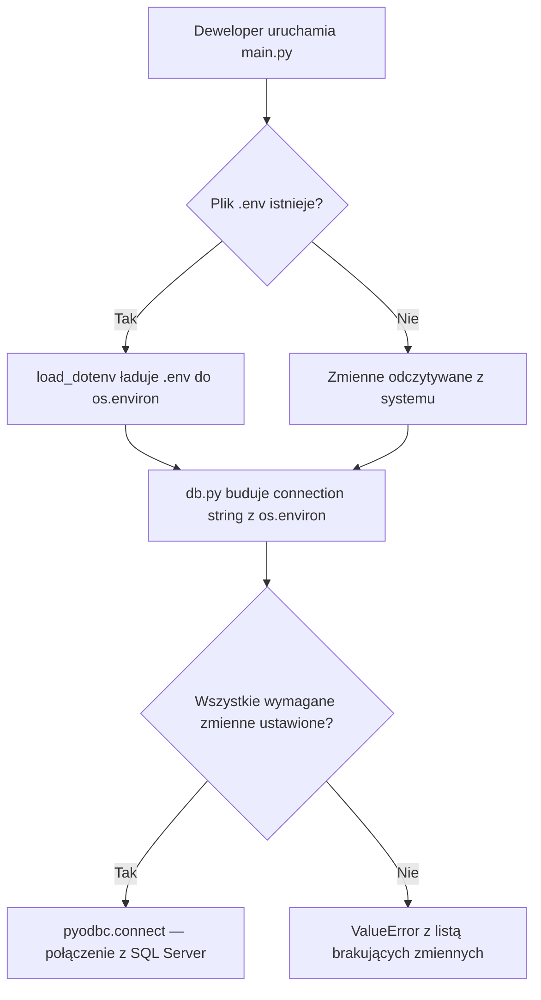
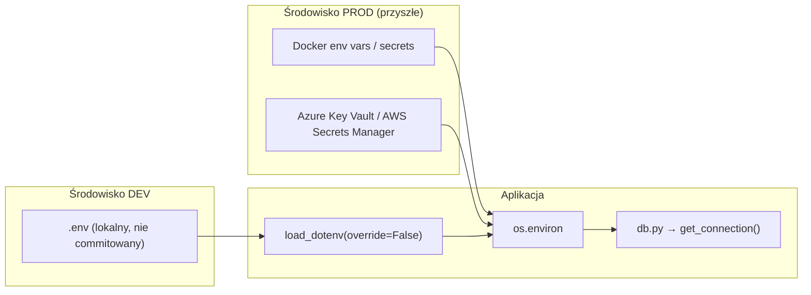

# Bezpieczne przechowywanie danych połączenia do bazy danych - Wynik analizy

## Szczegóły zadania

| Pole | Wartość |
|---|---|
| Jira ID | Brak (zadanie opisane bezpośrednio) |
| Tytuł | Bezpieczne przechowywanie danych połączenia do bazy danych |
| Opis | Usunięcie hardkodowanych credentials z `db.py`, wdrożenie bezpiecznego mechanizmu zarządzania danymi połączenia dla środowiska dev z możliwością rozszerzenia na prod. Likwidacja naruszeń SonarQube: `python:S2068` (Credentials should not be hard-coded) i `secrets:S6703` (Database passwords should not be disclosed). |
| Priorytet | Wysoki (bezpieczeństwo) |
| Zgłaszający | Deweloper / SonarQube |
| Data utworzenia | 2026-04-07 |
| Termin realizacji | Brak |
| Etykiety | security, credentials, configuration |
| Szacowany nakład pracy | S (mały — zmiana 1 pliku + pliki konfiguracyjne) |
| Złożoność analizy rozwiązań | M (Średnie) |

## Wpływ biznesowy

Hardkodowane credentials w kodzie źródłowym stanowią **krytyczne ryzyko bezpieczeństwa**: każda osoba z dostępem do repozytorium (nawet read-only) ma dostęp do danych logowania do bazy danych. W przypadku publicznego repozytorium lub wycieku kodu, atakujący może uzyskać pełny dostęp do bazy SQL Server — odczyt, modyfikację i usunięcie danych.

Naruszenia SonarQube:
- **`python:S2068`** (Medium) — Credentials should not be hard-coded — wykrywa hardkodowane hasła w connection stringach
- **`secrets:S6703`** (Blocker) — Database passwords should not be disclosed — wykrywa jawne hasła do baz danych w kodzie źródłowym

Wdrożenie bezpiecznego przechowywania credentials jest warunkiem koniecznym przed:
- Udostępnieniem repozytorium innym deweloperom
- Wdrożeniem aplikacji na środowisko produkcyjne (Docker/chmura)
- Przejściem audytu bezpieczeństwa (OWASP Top 10 — A07:2021 Identification and Authentication Failures)

## Zebrane informacje

### Baza wiedzy i narzędzia do zarządzania zadaniami

Brak zewnętrznych narzędzi (Jira, Confluence) — zadanie opisane bezpośrednio przez użytkownika z informacjami z SonarQube.

Kluczowe informacje z opisu zadania:
- **Reguła `python:S2068`**: Flaguje hardkodowane credentials w connection stringach i zmiennych o nazwach pasujących do wzorców `password`, `passwd`, `pwd`, `passphrase`
- **Reguła `secrets:S6703`**: Blocker-level — wykrywa jawne hasła do baz danych w kodzie źródłowym. Potencjalny wpływ: kompromitacja danych, security downgrade aplikacji
- CVE wymienione jako historyczne przykłady: CVE-2019-13466, CVE-2018-15389
- Użytkownik planuje: środowisko dev (teraz) + środowisko prod w przyszłości (Docker lub chmura)
- Użytkownik używa SQL Authentication (login/hasło), nie Windows Authentication

### Baza kodu

#### Architektura projektu

Minimalistyczna aplikacja CLI Python (5 plików źródłowych + 1 plik SQL):

| Plik | Rola | Relevance |
|------|------|-----------|
| `db.py` | Fabryka połączeń z SQL Server | **Główny cel zmian** — zawiera hardkodowane credentials |
| `runner.py` | Wykonuje zapytania SQL, mierzy czas | Konsumuje `get_connection()` — interfejs się nie zmieni |
| `main.py` | Orkiestrator CLI | Bez zmian — nie dotyka konfiguracji DB |
| `variants.py` | Generuje warianty zapytań SQL | Bez zmian |
| `query.sql` | Bazowe zapytanie SQL | Bez zmian |

#### Aktualny stan `db.py` (problem)

```python
# db.py
import pyodbc

def get_connection():
    return pyodbc.connect(
        "DRIVER={ODBC Driver 17 for SQL Server};"
        "SERVER=localhost;"
        "DATABASE=TwojaBaza;"
        "UID=sa;"
        "PWD=TwojeHaslo;"
    )
```

Wszystkie 5 parametrów connection stringa jest hardkodowanych — `SERVER`, `DATABASE`, `UID`, `PWD` oraz `DRIVER`.

#### Zależności

- `pyodbc==5.3.0` — jedyna zależność
- Brak `.env`, brak pliku konfiguracyjnego, brak użycia `os.environ`

#### Bezpieczeństwo

- `.gitignore` istnieje, ale nie zawiera wpisów `.env` ani plików konfiguracyjnych z credentials
- Brak mechanizmu oddzielenia konfiguracji od kodu
- README instruuje edycję `db.py` bezpośrednio — promuje anty-wzorzec

### Powiązane linki

- [OWASP A07:2021 — Identification and Authentication Failures](https://owasp.org/Top10/A07_2021-Identification_and_Authentication_Failures/)
- [12-Factor App — Config](https://12factor.net/config) — konfiguracja powinna być przechowywana w zmiennych środowiskowych
- [SonarQube Rule python:S2068](https://rules.sonarsource.com/python/RSPEC-2068/) — Credentials should not be hard-coded
- [SonarQube Rule secrets:S6703](https://rules.sonarsource.com/secrets/RSPEC-6703/) — Database passwords should not be disclosed
- [python-dotenv PyPI](https://pypi.org/project/python-dotenv/) — v1.2.2 (marzec 2026)

### Analiza rozwiązań

- Plik analizy: `.github/Issue/secure-database-credentials.solution-research.md`
- Rekomendowane rozwiązanie: **python-dotenv + zmienne środowiskowe (podejście hybrydowe)**
- Oceniona złożoność: M (Średnie)

Porównano 4 rozwiązania:
1. **python-dotenv + env vars** ⭐ Rekomendowane — najlepsza równowaga wygody dev i bezpieczeństwa prod
2. **Czyste env vars (os.environ)** — funkcjonalne, ale gorsza wygoda devowa
3. **python-decouple** — niepotrzebne castowanie typów, mniej popularny
4. **dynaconf** — overengineering dla minimalistycznego projektu

### Powiązane wykresy i diagramy





## Aktualny stan implementacji

### Istniejące komponenty

- `db.py` — `get_connection()` — wymaga modyfikacji (zamiana hardkodowanych credentials na `os.environ`)
- `runner.py` — `run_query()` → `get_connection()` — można ponownie użyć bez zmian
- `main.py` — orkiestrator — można ponownie użyć bez zmian
- `variants.py` — generator wariantów — można ponownie użyć bez zmian
- `.gitignore` — wymaga rozszerzenia (dodanie `.env`)
- `requirements.txt` — wymaga rozszerzenia (dodanie `python-dotenv`)
- `README.md` — wymaga modyfikacji (sekcja Configuration)
- `CHANGELOG.md` — wymaga wpisu w `[Unreleased]`

### Kluczowe pliki i katalogi

- `db.py` — jedyny plik wymagający modyfikacji kodu
- `.gitignore` — musi blokować commitowanie `.env`
- `.env.example` — nowy plik — szablon konfiguracji (bez prawdziwych wartości)
- `requirements.txt` — dodanie `python-dotenv`
- `README.md` — aktualizacja sekcji Configuration z nowym podejściem

## Analiza luk

### Pytanie 1
#### Czy w środowisku developerskim korzystasz z Windows Authentication (Trusted Connection) do SQL Server, czy wymagasz logowania przez login/hasło (SQL Auth)?
Użytkownik korzysta z **SQL Authentication (login/hasło)**. Rozwiązanie powinno obsługiwać zmienne `DB_UID` i `DB_PWD` jako wymagane.

### Pytanie 2
#### Gdzie planujesz uruchamiać aplikację w środowisku produkcyjnym?
Użytkownik planuje **Docker (2) lub chmurę (3)** — oba dostarczają credentials przez zmienne środowiskowe. Rekomendowane podejście (python-dotenv + env vars) jest w pełni kompatybilne z oboma scenariuszami:
- **Docker**: credentials przekazywane przez `docker run -e DB_PWD=...` lub `docker-compose.yml` (env_file / environment)
- **Chmura**: credentials zarządzane przez secrets manager (Azure Key Vault, AWS Secrets Manager) i wstrzykiwane jako env vars do runtime

### Pytanie 3
#### Jakie zmienne konfiguracyjne powinny być eksternalizowane?
Na podstawie analizy aktualnego connection stringa w `db.py`, rekomendowane zmienne:

| Zmienna | Wymagana | Wartość domyślna | Opis |
|---------|----------|------------------|------|
| `DB_DRIVER` | Nie | `ODBC Driver 17 for SQL Server` | Sterownik ODBC — konfigurowalna na wypadek aktualizacji do Driver 18 |
| `DB_SERVER` | Tak | — | Adres instancji SQL Server |
| `DB_DATABASE` | Tak | — | Nazwa bazy danych |
| `DB_UID` | Tak | — | Login do bazy danych |
| `DB_PWD` | Tak | — | Hasło do bazy danych |

### Pytanie 4
#### Czy plik `.env` powinien wspierać wariant Trusted Connection (Windows Auth) w przyszłości?
Aktualnie nie jest wymagany (użytkownik korzysta z SQL Auth). Można dodać w przyszłości jako opcjonalną zmienną `DB_TRUSTED_CONNECTION=yes` bez łamania kompatybilności wstecznej.
