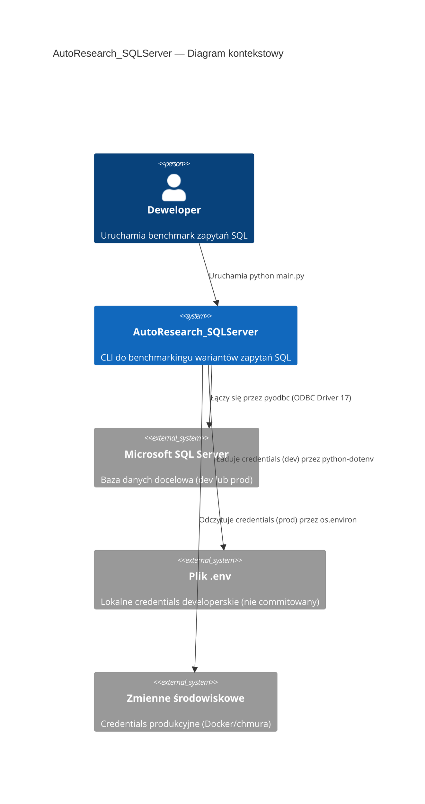

# Bezpieczne przechowywanie danych połączenia do bazy danych - Analiza Rozwiązań

## Podsumowanie

| Pole | Wartość |
|---|---|
| Zadanie | Bezpieczne przechowywanie danych połączenia do bazy danych |
| Oceniona złożoność | M (Średnie) |
| Liczba przeanalizowanych źródeł | 8 |
| Rekomendowane rozwiązanie | python-dotenv + zmienne środowiskowe (podejście hybrydowe) |
| Powiązany Research | `secure-database-credentials.research.md` |
| Data analizy | 2026-04-07 |

## Pytania Badawcze

1. Jakie podejścia do zarządzania credentials w aplikacjach Python CLI są najczęściej stosowane?
2. Które rozwiązanie najlepiej pasuje do minimalistycznej architektury projektu AutoResearch_SQLServer?
3. Jak zapewnić obsługę wielu środowisk (dev/prod) bez overengineeringu?
4. Jak spełnić wymogi bezpieczeństwa SonarQube (python:S2068, secrets:S6703) przy minimalnej złożoności?

## Przeanalizowane Źródła

### Repozytoria i Projekty Open-Source

| # | Nazwa | URL | Licencja | Gwiazdki / Aktywność | Kluczowe wnioski | Ocena |
|---|-------|-----|---------|----------------------|------------------|-------|
| 1 | python-dotenv | https://github.com/theskumar/python-dotenv | BSD | ~7.5k ⭐, aktywny (v1.2.2, marzec 2026) | Standardowy pakiet do ładowania .env do os.environ. Zero sub-dependencies. Wspiera Python 3.10–3.14. | 🟢 |
| 2 | python-decouple | https://github.com/HBNetwork/python-decouple | MIT | ~2.7k ⭐, aktywny | Alternatywa z wbudowanym castowaniem typów. Bardziej rozbudowany niż dotenv. | 🟡 |
| 3 | dynaconf | https://github.com/dynaconf/dynaconf | MIT | ~3.5k ⭐, aktywny | Zaawansowane zarządzanie konfiguracją z wieloma backendami (env, ini, yaml, toml, redis, vault). Duży jak na ten projekt. | 🔴 |

### Dokumentacje i API

| # | Nazwa | URL | Typ | Kluczowe wnioski | Ocena |
|---|-------|-----|-----|------------------|-------|
| 1 | python-dotenv docs | https://pypi.org/project/python-dotenv/ | docs | `load_dotenv(override=False)` nie nadpisuje istniejących zmiennych systemowych — idealny wzorzec dla prod. | 🟢 |
| 2 | pyodbc connection string | https://github.com/mkleehammer/pyodbc/wiki/Connecting-to-SQL-Server-from-Windows | docs | Wzorce connection string dla SQL Server: SQL Auth i Windows Auth (Trusted_Connection). | 🟢 |
| 3 | OWASP Credential Management | https://cheatsheetseries.owasp.org/cheatsheets/Secrets_Management_Cheat_Sheet.html | docs | Rekomendacje OWASP: nigdy nie hardkoduj credentials, używaj zmiennych środowiskowych lub vault. | 🟢 |
| 4 | 12-Factor App Config | https://12factor.net/config | docs | Konfiguracja powinna być przechowywana w zmiennych środowiskowych — separacja kodu od konfiguracji. | 🟢 |

### Rejestry Pakietów

| # | Pakiet | Rejestr | Wersja | Pobrania / Popularność | Kluczowe wnioski | Ocena |
|---|--------|---------|--------|------------------------|------------------|-------|
| 1 | python-dotenv | PyPI | 1.2.2 | ~45M/miesiąc | Najczęściej używany pakiet do .env w Pythonie. Python 3.10+. Zero zależności. | 🟢 |

## Matryca Porównawcza

| Kryterium | A: python-dotenv + env vars | B: Czyste env vars (os.environ) | C: python-decouple | D: dynaconf |
|---|---|---|---|---|
| Dopasowanie do wymagań | ⭐⭐⭐⭐⭐ | ⭐⭐⭐⭐ | ⭐⭐⭐⭐ | ⭐⭐⭐ |
| Dojrzałość i stabilność | ⭐⭐⭐⭐⭐ | ⭐⭐⭐⭐⭐ (stdlib) | ⭐⭐⭐⭐ | ⭐⭐⭐⭐ |
| Jakość dokumentacji | ⭐⭐⭐⭐⭐ | ⭐⭐⭐⭐⭐ (stdlib) | ⭐⭐⭐⭐ | ⭐⭐⭐⭐ |
| Licencja i koszty | BSD (wolna) | Brak (stdlib) | MIT (wolna) | MIT (wolna) |
| Złożoność integracji | ⭐⭐⭐⭐⭐ (2 linie kodu) | ⭐⭐⭐⭐ (ręczne ustawianie env) | ⭐⭐⭐⭐ | ⭐⭐⭐ |
| Wydajność i skalowalność | ⭐⭐⭐⭐⭐ | ⭐⭐⭐⭐⭐ | ⭐⭐⭐⭐⭐ | ⭐⭐⭐⭐ |
| Bezpieczeństwo | ⭐⭐⭐⭐⭐ | ⭐⭐⭐⭐⭐ | ⭐⭐⭐⭐⭐ | ⭐⭐⭐⭐⭐ |
| Krzywa uczenia się | ⭐⭐⭐⭐⭐ | ⭐⭐⭐⭐⭐ | ⭐⭐⭐⭐ | ⭐⭐⭐ |
| Wygoda dev (DX) | ⭐⭐⭐⭐⭐ | ⭐⭐⭐ | ⭐⭐⭐⭐ | ⭐⭐⭐⭐ |
| Minimalizm zależności | ⭐⭐⭐⭐ (1 mikro-pakiet) | ⭐⭐⭐⭐⭐ (zero) | ⭐⭐⭐⭐ (1 pakiet) | ⭐⭐ (wiele) |
| Obsługa wielu środowisk | ⭐⭐⭐⭐⭐ | ⭐⭐⭐⭐ | ⭐⭐⭐⭐⭐ | ⭐⭐⭐⭐⭐ |
| **Ocena ogólna** | **⭐⭐⭐⭐⭐** | **⭐⭐⭐⭐** | **⭐⭐⭐⭐** | **⭐⭐⭐** |

## Analiza Kandydatów

### A: python-dotenv + zmienne środowiskowe (podejście hybrydowe)

**Opis**: Pakiet `python-dotenv` (v1.2.2) ładuje pary klucz-wartość z pliku `.env` do `os.environ`. Na produkcji (Docker/chmura) zmienne ustawiane są bezpośrednio w środowisku — `load_dotenv(override=False)` ich nie nadpisuje.

**Korzyści**:
- Wygodne w dev: plik `.env` z lokalnymi credentials, brak konieczności ustawiania zmiennych systemowych ręcznie
- Bezpieczne na prod: `override=False` oznacza, że zmienne systemowe mają priorytet nad `.env`
- `.env.example` w repozytorium jako dokumentacja wymaganych zmiennych (bez wartości)
- Zero sub-dependencies — mikro-pakiet (~20KB)
- Zgodne z 12-Factor App i rekomendacjami OWASP
- Tryb `PYTHON_DOTENV_DISABLED=1` na produkcji całkowicie wyłącza ładowanie `.env`
- Naturalny fallback chain: `.env` → zmienne systemowe

**Wady**:
- Dodaje 1 zależność (choć minimalną)
- Instrukcje projektu mówią "NIE dodawaj zależności bez uzasadnienia" — wymaga uzasadnienia bezpieczeństwem

**Uzasadnienie**: Rekomendowane. Najlepsza równowaga między wygodą dev, bezpieczeństwem i minimalnością. Dodanie 1 mikro-zależności jest w pełni uzasadnione eliminacją krytycznej luki bezpieczeństwa (hardkodowane credentials).

### B: Czyste zmienne środowiskowe (os.environ) — bez dodatkowych zależności

**Opis**: Użycie wyłącznie `os.environ` / `os.getenv()` bez jakichkolwiek dodatkowych pakietów. Deweloper ustawia zmienne ręcznie w powłoce lub profilu PowerShell.

**Korzyści**:
- Zero dodatkowych zależności — maksymalny minimalizm
- Standardowy mechanizm Pythona (stdlib)
- Idealnie działa w Docker i CI/CD

**Wady**:
- Niewygodne w dev: trzeba ręcznie ustawiać zmienne przed każdym uruchomieniem lub dodać je do profilu PowerShell
- Brak pliku deklarującego wymagane zmienne — wymaga dokumentacji w README
- Łatwo zapomnieć ustawić zmienną → kryptyczny błąd pyodbc zamiast czytelnego komunikatu
- Brak standaryzacji pliku `.env.example` jako szablonu konfiguracji

**Uzasadnienie**: Funkcjonalnie poprawne, ale gorsze DX (Developer Experience). Brak `.env` oznacza, że deweloper musi pamiętać o ustawianiu zmiennych lub tworzyć skrypt wrapperowy.

### C: python-decouple

**Opis**: Pakiet `python-decouple` oddziela ustawienia od kodu. Obsługuje `.env`, `.ini` i zmienne środowiskowe z wbudowanym castowaniem typów.

**Korzyści**:
- Wbudowane castowanie typów (`config('PORT', cast=int)`)
- Obsługa wielu formatów (`.env`, `.ini`)
- Dojrzały i stabilny

**Wady**:
- Castowanie typów niepotrzebne w tym projekcie (wszystkie wartości to stringi)
- Mniej popularny niż python-dotenv (~3x mniej pobrań)
- Zależność bez wyraźnej przewagi nad python-dotenv dla tego use case

**Uzasadnienie**: Odrzucone. Funkcjonalność castowania typów nie wnosi wartości — connection string składa się wyłącznie ze stringów.

### D: dynaconf

**Opis**: Zaawansowany framework do zarządzania konfiguracją z wieloma backendami (env, ini, yaml, toml, redis, HashiCorp Vault).

**Korzyści**:
- Obsługa wielu backendów (w tym Vault do produkcyjnych secretów)
- Walidacja konfiguracji, wbudowane profile środowisk
- Feature-rich

**Wady**:
- Ciężki jak na minimalistyczny projekt CLI (wiele sub-dependencies)
- Złożoność konfiguracji samego dynaconf jest nieproporcjonalna do wielkości projektu
- Krzywa uczenia się znacząco większa

**Uzasadnienie**: Odrzucone. Overengineering — projekt ma 5 plików źródłowych i 1 zależność. Dynaconf dodałby więcej złożoności niż wartości.

## Rekomendacja

### Wybrane rozwiązanie

**python-dotenv + zmienne środowiskowe (podejście hybrydowe)**

### Uzasadnienie wyboru

1. **Eliminuje lukę bezpieczeństwa**: Likwiduje hardkodowane credentials (python:S2068, secrets:S6703) — jest to główny cel zadania.
2. **Minimalna inwazyjność**: 1 mikro-zależność bez sub-dependencies, 2 linie kodu do integracji (`from dotenv import load_dotenv; load_dotenv()`).
3. **Wygodne w dev**: Plik `.env` z lokalnymi credentials — deweloper tworzy go raz i pracuje bez ręcznego ustawiania zmiennych.
4. **Bezpieczne na prod**: `load_dotenv(override=False)` respektuje istniejące zmienne systemowe. W Docker/chmurze credentials ustawiane są przez środowisko uruchomieniowe (env vars kontenera, secrets managery), nie przez plik.
5. **Zgodne z 12-Factor App**: Separacja konfiguracji od kodu — kluczowa zasada dla aplikacji dążących do produkcyjnego wdrożenia.
6. **Przyszłościowe**: Podejście jest kompatybilne z Docker secrets, Azure Key Vault i innymi managerami secretów — wszystkie ostatecznie dostarczają wartości jako zmienne środowiskowe.

### Przewaga nad alternatywami

- Względem **czystych env vars (B)**: Lepsza wygoda developerska — `.env` eliminuje konieczność ręcznego ustawiania zmiennych. `.env.example` jako dokumentacja.
- Względem **python-decouple (C)**: Bardziej popularny, lepiej znany, nie dodaje niepotrzebnego castowania typów.
- Względem **dynaconf (D)**: Znacząco prostszy, zero overengineeringu, lepsze dopasowanie do minimalistycznej architektury projektu.

## Model C4 Context

### Opis elementów diagramu

| Element | Typ | Opis |
|---------|-----|------|
| dev | Person | Deweloper uruchamiający narzędzie benchmarkowe lokalnie |
| app | System | Aplikacja CLI AutoResearch_SQLServer |
| sqlserver | System_Ext | Instancja SQL Server (dev lub prod) |
| envfile | System_Ext | Plik `.env` z credentials — używany tylko w developmencie, nie commitowany do repozytorium |
| sysenv | System_Ext | Zmienne środowiskowe systemu — źródło credentials na produkcji (Docker env vars, K8s secrets, cloud secrets manager) |

## Rejestry Decyzji Architektonicznych (ADR)

Nie dotyczy — złożoność M, uzasadnienie decyzji zawarte w sekcji Rekomendacja.

## Otwarte Pytania

| # | Pytanie | Status |
|---|---------|--------|
| 1 | Czy w przyszłości planowany jest Docker Compose z wieloma bazami (dev/test/prod jednocześnie)? | ❓ Otwarte — nie wpływa na obecne rozwiązanie, ale wpłynie na strukturę `.env` plików |

## Następne Kroki

- Wdrożenie rekomendowanego rozwiązania: refaktor `db.py`, dodanie `python-dotenv` do `requirements.txt`, utworzenie `.env.example`, aktualizacja `.gitignore`, `README.md` i `CHANGELOG.md`
